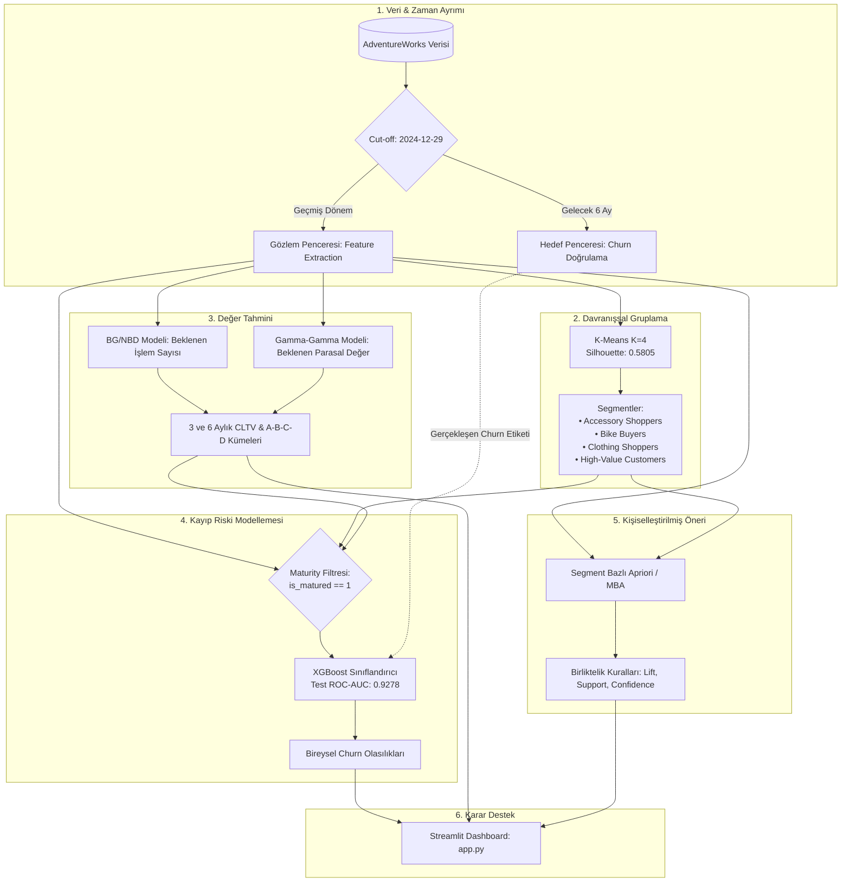
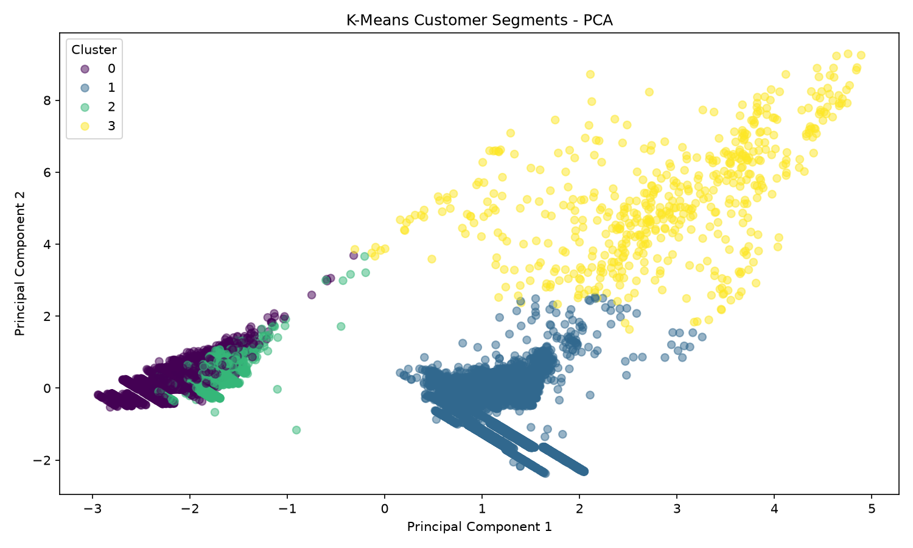
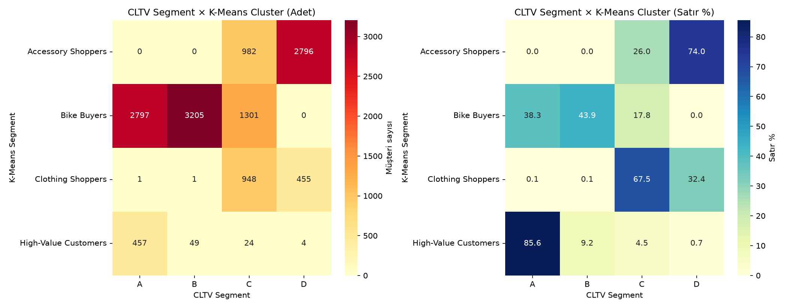
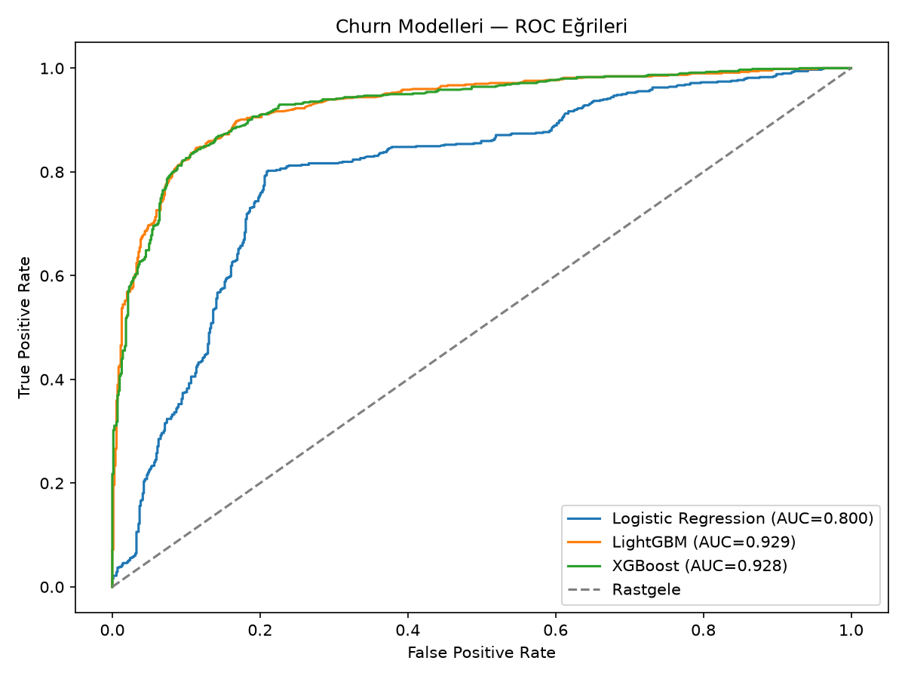
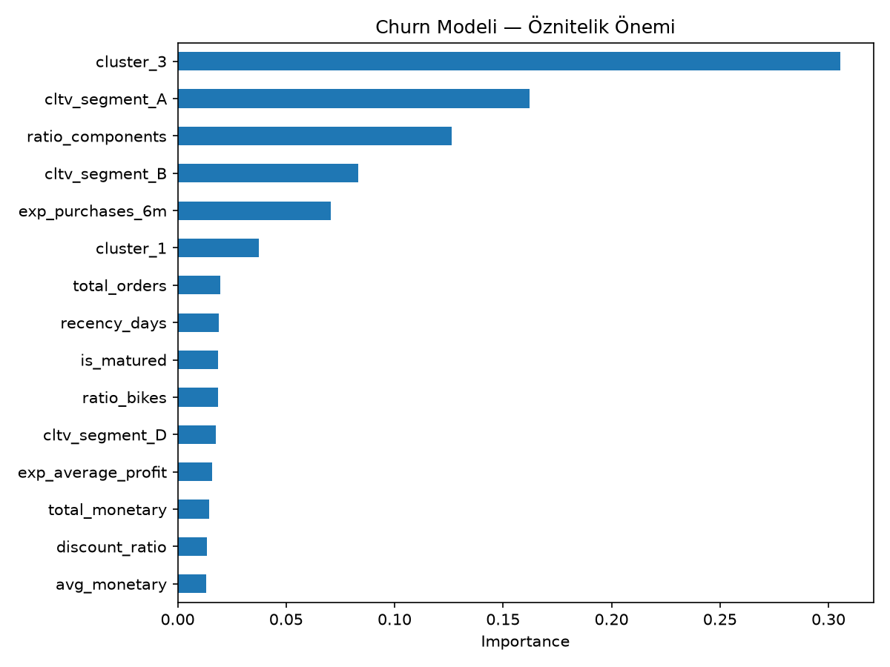

# Custora — Uçtan Uca Müşteri Zekası ve Karar Destek Sistemi

[](https://www.python.org/)
[](https://streamlit.io/)
[](https://scikit-learn.org/)
[](https://xgboost.readthedocs.io/)
[](https://lifetimes.readthedocs.io/)

**Custora**, AdventureWorks perakende veri seti üzerinde müşteri davranışını çok boyutlu olarak analiz eden, makine öğrenmesi ve olasılıksal modellerle müşteri kaybını (churn) önceden tahmin eden, müşteri yaşam boyu değerini (CLTV) hesaplayan ve segmente özel ürün tavsiyeleri üreten uçtan uca bir karar destek sistemidir.

Klasik veri bilimi projelerinin aksine Custora; denetimsiz öğrenme (K-Means), olasılıksal modelleme (BG/NBD & Gamma-Gamma), denetimli öğrenme (XGBoost) ve birliktelik kuralı analizini (Apriori) birbirini besleyen tek bir analitik hatta birleştirir.

---

## İçindekiler
- [Proje Mimarisi](#proje-mimarisi)
- [Temel Zorluk: Yapay Churn Tuzağı ve "Maturity" Çözümü](#temel-zorluk-yapay-churn-tuzagi-ve-maturity-cözümü)
- [Modüller ve Metodoloji](#modüller-ve-metodoloji)
  - [1. Veri Hazırlığı & Sızıntı (Data Leakage) Koruması](#1-veri-hazirligi--sizinti-data-leakage-korumasi)
  - [2. Davranışsal Segmentasyon (K-Means Clustering)](#2-davranissal-segmentasyon-k-means-clustering)
  - [3. Müşteri Yaşam Boyu Değeri (BG/NBD & Gamma-Gamma CLTV)](#3-müsteri-yasam-boyu-degeri-bgnbd--gamma-gamma-cltv)
  - [4. Müşteri Kaybı Tahmini (XGBoost Churn Prediction)](#4-müsteri-kaybi-tahmini-xgboost-churn-prediction)
  - [5. Segmente Özel Birliktelik Analizi (Market Basket & Apriori)](#5-segmente-özel-birliktelik-analizi-market-basket--apriori)
  - [6. Streamlit Karar Destek Arayüzü](#6-streamlit-karar-destek-arayüzü)
- [Performans ve Model Metrikleri](#performans-ve-model-metrikleri)
- [Kurulum ve Çalıştırma](#kurulum-ve-calistirma)
- [Proje Dizin Yapısı](#proje-dizin-yapisi)

---

## Proje Mimarisi

Aşağıdaki şema, ham veriden son kullanıcı karar arayüzüne kadar uzanan veri akışını ve modeller arasındaki bağımlılıkları özetlemektedir:



---

## Temel Zorluk: Yapay Churn Tuzağı ve "Maturity" Çözümü

Perakende analitiğinde sıklıkla yapılan hata, **"Son 6 ayda alışveriş yapmayan herkes kayıptır (churn)"** varsayımıdır. 

Veri setinde yapılan satın alma aralığı (inter-purchase interval) analizinde:
- Ortalama satın alma döngüsü: **261 gün**
- Medyan satın alma döngüsü: **138 gün**
- 180 günden uzun aralıklar: **%44,76**

Bisiklet gibi dayanıklı tüketim mallarında müşterilerin 6 ay sipariş vermemesi, onların sistemi terk ettiğini değil; doğal satın alma döngülerinde olduklarını gösterir. Ayrıca henüz ilk alışverişini cut-off tarihinden 2 ay önce yapmış yeni bir müşteriye "6 aydır sipariş vermedi" diyerek churn etiketi basmak **veri sızıntısına ve sahte churn gürültüsüne** yol açar.

### Çözüm: Müşteri Olgunluğu (`is_matured`)
Model eğitiminde yalnızca kendi döngüsünü tamamlayacak kadar sistemde kalmış müşteriler (`is_matured == 1`, 7.001 müşteri) kullanılmıştır. Bu filtreleme:
1. Sınıf dengesini doğal olarak **%49,85 churn / %50,15 retained** seviyesine getirmiş,
2. Sentetik veri türetme (SMOTE) veya agresif sınıf ağırlıklandırma ihtiyacını ortadan kaldırmış,
3. Modelin yapay gürültüyü değil, gerçek kayıp davranışını öğrenmesini sağlamıştır.

---

## Modüller ve Metodoloji

### 1. Veri Hazırlığı & Sızıntı (Data Leakage) Koruması
- **Cut-off Tarihi:** `2024-12-29`
- Veri seti, gözlem dönemi (features) ve hedef dönemi (target) olarak ikiye ayrılmıştır. Geleceğe ait hiçbir harcama veya işlem bilgisi eğitim değişkenlerine dahil edilmemiştir.
- Aşırı sağa çarpık dağılıma sahip parasal büyüklükler ve sepet hacimlerine `log1p` dönüşümü uygulanmış, model girişleri `StandardScaler` ile normalize edilmiştir.

### 2. Davranışsal Segmentasyon (K-Means Clustering)
RFM skorları kategorik harcama tercihlerini yakalayamaz. Custora, müşterinin harcadığı toplam paranın yanında **kategori dağılımlarını (Bikes, Accessories, Clothing, Components)** K-Means algoritmasına girdi olarak verir.

- $K=2$ ile $K=10$ aralığında yapılan testlerde **$K=4$** değeri **0.5805 Silhouette Skoru** ile optimal seçilmiştir.
- **Segment Profilleri:**
  - `Accessory Shoppers` (%29.02): Düşük sepet, yüksek aksesuar oranı.
  - `Bike Buyers` (%56.09): Yüksek ortalama sepet, bisiklet odaklı.
  - `Clothing Shoppers` (%10.79): Giyim ağırlıklı sepet profili.
  - `High-Value Customers` (%4.10): Çoklu sipariş, yüksek hacim, B2B benzeri sepet büyüklüğü.



### 3. Müşteri Yaşam Boyu Değeri (BG/NBD & Gamma-Gamma CLTV)
Müşterilerin gelecekteki parasal potansiyelini öngörmek için perakende standardı olan `lifetimes` modelleri kurulmuştur:
- **BG/NBD (Beta-Geometric / Negative Binomial Distribution):** Müşteri işlem frekansı ve recency değerlerinden hareketle gelecek 3 ve 6 aydaki beklenen işlem sayısı (`conditional_expected_number_of_purchases_up_to_time`).
- **Gamma-Gamma Submodel:** Tekrar eden alıcıların işlem başına beklenen ortalama parasal değeri (`conditional_expected_average_profit`).
- **CLTV Skorlaması:** %1 aylık iskonto oranı ile 3 ve 6 aylık parasal değer hesaplanarak müşteriler A, B, C, D çeyrekliklerine ayrılmıştır.

K-Means segmentleri ile CLTV segmentleri çapraz karşılaştırıldığında, High-Value grubunun %85,6'sının A diliminde yer aldığı; buna karşın Bike Buyers grubunun yüksek birim fiyat nedeniyle A ve B dilimlerine dengeli dağıldığı doğrulanmıştır.



### 4. Müşteri Kaybı Tahmini (XGBoost Churn Prediction)
Gözlem metrikleri, K-Means küme üyelikleri ve CLTV tahminleri öznitelik havuzunda birleştirilerek denetimli modeller eğitilmiştir:

- **Veri Ayrımı:** %64 Train (4.480), %16 Validation (1.120), %20 Test (1.401).
- **Aday Modeller:**
  - Baseline (Logistic Regression): ROC-AUC 0.8000
  - LightGBM: ROC-AUC 0.9100
  - **XGBoost (Seçilen Final Model):** Validation ROC-AUC 0.9100, **Test ROC-AUC 0.9278**
- **Öznitelik Önemi:** Model kararlarında `cluster_3` (High-Value Customers segmenti) %54 önem payı ile en belirleyici faktör olmuştur. K-Means ve CLTV türevi metrikler toplam model öneminin %71'inden fazlasını oluşturmaktadır.

| ROC Eğrileri | Öznitelik Önemi |
| :---: | :---: |
|  |  |

### 5. Segmente Özel Birliktelik Analizi (Market Basket & Apriori)
Tüm müşterilere genel geçer kurallar önermek yerine, **her K-Means kümesi için ayrı sepet matrisleri** oluşturulmuş ve `mlxtend` Apriori algoritmasıyla birliktelik kuralları (Association Rules) çıkarılmıştır:
- Yüksek churn riski taşıyan ve yüksek CLTV segmentindeki (A veya B) müşteriler tespit edilir.
- Müşterinin son satın aldığı ürüne göre en yüksek **Lift** ve **Confidence** değerine sahip tamamlayıcı ürün önerisi dinamik olarak atanır.

### 6. Streamlit Karar Destek Arayüzü
Geliştirilen boru hattı çıktısı, pazarlama ve CRM ekiplerinin anlık müşteri sorgulaması yapabileceği interaktif bir Streamlit uygulaması olarak sunulmuştur.

- **Müşteri Arama:** ID veya isim ile 13.020 kayıt arasında anında sorgulama.
- **360° Analitik Kartı:** 3 ve 6 aylık tahmini CLTV, Churn risk yüzdesi ve risk seviyesi (Düşük / Orta / Yüksek).
- **Aksiyon Matrisi Önerisi:** Churn riski ve CLTV segmentine göre otomatik belirlenen CRM aksiyonu (örn. VIP Sadakat Programı, Reaktivasyon Kuponu, Çapraz Satış Kampanyası).
- **Önerilen Ürün:** Müşterinin profiline özel birliktelik kuralı çıktısı ve güven skorları.

---

## Performans ve Model Metrikleri

Bağımsız test setinde (1.401 müşteri) elde edilen XGBoost performans metrikleri:

| Metrik | Değer |
| :--- | :--- |
| **ROC-AUC** | **0.9278** |
| **F1-Score** | **0.8576** |
| **Precision** | **0.8748** |
| **Recall** | **0.8410** |
| **K-Means Silhouette** | **0.5805** (K=4) |

---

## Kurulum ve Çalıştırma

### Gereksinimler
- Python 3.10 veya üzeri
- Git

### 1. Depoyu Klonlayın
```bash
git clone https://github.com/zerabetty/Custora.git
cd Custora
```

### 2. Sanal Ortam Oluşturun ve Aktive Edin
```bash
# Windows
python -m venv venv
.\venv\Scripts\activate

# macOS / Linux
python3 -m venv venv
source venv/bin/activate
```

### 3. Bağımlılıkları Yükleyin
```bash
pip install -r requirements.txt
```

### 4. Bütün ML Boru Hattını Çalıştırın
Tüm modelleme, segmentasyon, CLTV ve churn skorlamalarını baştan çalıştırmak için:
```bash
python main.py
```
*Bu komut, ham veriyi okur, modelleri eğitir ve `customer_features.csv` ile `customer_recommendations.csv` dosyalarını günceller.*

### 5. Karar Destek Arayüzünü Başlatın
```bash
streamlit run app.py
```
Tarayıcınızda otomatik olarak `http://localhost:8501` adresi açılacaktır.

---

## Proje Dizin Yapısı

```text
Custora/
├── .streamlit/
│   └── config.toml                  # Streamlit görsel tema ve sunucu yapılandırması
├── assets/
│   └── style.css                    # Dashboard özel CSS stilleri
├── src/
│   ├── __init__.py
│   ├── data_loader.py               # Ham veri yükleme ve temel doğrulama
│   ├── preprocessing.py            # EDA, satın alma aralıkları, scaling ve log dönüşümleri
│   ├── segmentation.py             # K-Means clustering, silhouette analizi ve PCA
│   ├── cltv.py                     # BG/NBD ve Gamma-Gamma CLTV hesaplama motoru
│   ├── churn.py                    # Maturity filtreleme, model eğitimi (XGBoost) ve değerlendirme
│   └── recommendation.py           # Segmente özel Apriori ve birliktelik kuralları
├── adventureworks_data.csv          # Ham işlem ve müşteri tablosu
├── customer_features.csv            # Zenginleştirilmiş analitik müşteri veri seti
├── customer_recommendations.csv     # Üretilen kişiselleştirilmiş ürün tavsiyeleri
├── churn_feature_importance.png     # XGBoost öznitelik önem grafiği
├── churn_roc_curves.png             # Model ROC eğrileri karşılaştırması
├── cltv_kmeans_crosstab.png         # K-Means x CLTV ısı haritası
├── kmeans_pca_clusters.png          # 2D PCA kümeleme görselleştirmesi
├── process_report.md                # Ayrıntılı mühendislik ve süreç raporu
├── project_plan.md                  # İlk proje adımları ve mimari planı
├── requirements.txt                 # Python paket bağımlılıkları
├── main.py                          # Ana orkestratör boru hattı
├── app.py                           # Streamlit arayüz uygulaması
└── README.md                        # Proje dokümantasyonu
```

---

## Lisans ve İletişim

Bu proje açık kaynaklıdır ve eğitim / karar destek prototipi olarak geliştirilmiştir. Katkı ve sorularınız için GitHub üzerinden issue açabilir veya iletişime geçebilirsiniz.
